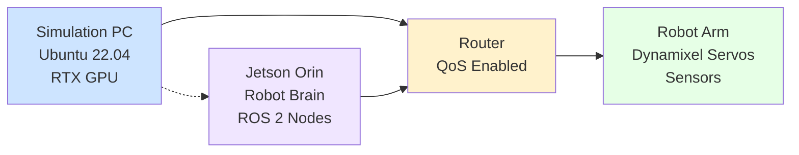

# Chapter 2: Hardware Lab Setup

## Learning Objectives

By the end of this chapter, you should be able to:
- Configure a Physical AI Workstation suitable for robotics applications
- Set up a Robot Brain using appropriate edge computing platforms
- Identify and select appropriate hardware components for humanoid robotics
- Establish networking connections between robotic systems and development computers

## Hardware Specifications

This section details key hardware components necessary for building a humanoid robot system and physical AI workstation. Selecting the right hardware is critical for performance and compatibility with the software stack (ROS 2 Humble, NVIDIA Isaac Sim, VLA Models, and Python).

### Edge Computer Options

For the robot's "brain," we recommend the NVIDIA Jetson series due to their excellent balance of processing power, energy efficiency, and support for AI workloads:

#### NVIDIA Jetson Orin Nano
- **Architecture**: ARM64
- **CUDA cores**: 128
- **Memory**: 2GB or 4GB LPDDR5
- **Power consumption**: 7W-15W
- **Cost-effective solution** for lightweight robotics applications
- Perfect for running ROS 2 nodes and basic AI models

#### NVIDIA Jetson AGX Orin
- **Architecture**: ARM64
- **CUDA cores**: 2048
- **Memory**: 32GB LPDDR5
- **Power consumption**: Up to 60W
- **High-performance solution** for complex AI models and real-time processing
- Ideal for running sophisticated VLA models and perception systems

The choice between these platforms depends on your specific requirements for compute power, power consumption, and budget. The Jetson Orin Nano is sufficient for many educational purposes, while the AGX Orin is more appropriate for production-level humanoid robots.

### Vision System: Intel RealSense D435i

For depth perception and spatial awareness, the Intel RealSense D435i is an excellent choice:
- **RGB resolution**: 1920x1080 @ 30 FPS
- **Depth resolution**: 1280x720 @ 90 FPS
- **Field of view**: 87° H × 58° V × 94° D (diagonal)
- **Connectivity**: USB 3.0
- **Integrated IMU** for motion tracking
- **Stereo depth technology** for accurate distance measurements

This camera is ideal for creating 3D maps, object recognition, and navigation tasks.

### Robot Manipulator: WidowX 250 6-DOF Arm

For manipulation capabilities, we recommend the WidowX 250:
- **Degrees of freedom**: 6
- **Reach**: 250mm
- **Payload capacity**: 100g at full reach
- **Servos**: Compatible with Robotis Dynamixel
- **Open-source hardware design**
- Excellent for learning manipulation skills and dexterity

Alternative options include equivalent 6-DOF arms with similar specifications.

### Simulation PC Requirements

For running simulations (Gazebo, NVIDIA Isaac Sim) and training AI models:
- **Minimum GPU**: NVIDIA RTX 3060 (12GB VRAM)
- **Recommended GPU**: NVIDIA RTX 4070 or higher
- **CPU**: Modern multi-core processor (Intel i7 or AMD Ryzen 7)
- **RAM**: 32GB or more
- **OS**: Ubuntu 22.04 LTS (compatible with ROS 2 Humble)
- **Storage**: SSD with 500GB+ free space

The Simulation PC handles intensive computations for physics simulation, rendering, and AI model training.

## Key Concepts

### ARM64 vs x86 Architecture

Understanding the differences between ARM64 and x86 architectures is crucial for selecting appropriate hardware:

- **ARM64 (AArch64)**: Used by NVIDIA Jetson platforms, offers better power efficiency and thermal management, ideal for embedded robotics applications
- **x86**: Traditional architecture used by most desktop computers, offers broader software compatibility

Be aware of compatibility issues when developing cross-platform software and consider using containerization technologies like Docker to ensure compatibility.

### CUDA Cores and Tensor Cores

- **CUDA Cores**: Parallel processing units that execute computations on NVIDIA GPUs, critical for accelerating neural network inference and training
- **Tensor Cores**: Specialized processing units in newer NVIDIA GPUs that accelerate deep learning operations, especially mixed-precision computations

The number of CUDA cores significantly impacts the performance of AI workloads in robotics applications.

## Bill of Materials (BOM)

This table provides a comprehensive list of hardware components needed for the Physical AI workstation and robot.

| Component | Model | Approx Price | Link | Notes |
|-----------|-------|--------------|------|-------|
| Edge Computer | NVIDIA Jetson Orin Nano | $300-$400 | [NVIDIA Store](https://developer.nvidia.com/embedded/jetson-orin-nano-developer-kit) | 128 CUDA cores, 4GB RAM |
| Alternative Edge Computer | NVIDIA Jetson AGX Orin | $750-$1000 | [NVIDIA Store](https://developer.nvidia.com/embedded/jetson-agx-orin-developer-kit) | 2048 CUDA cores, 32GB RAM |
| Vision System | Intel RealSense D435i | $179 | [Intel Store](https://www.intelrealsense.com/depth-camera-d435i/) | RGB + Depth camera |
| Robot Arm | WidowX 250 6-DOF | $1000-$1200 | [Trossen Robotics](https://www.trossenrobotics.com/widowx-250-robot-arm.aspx) | 6 degrees of freedom |
| Simulation PC GPU | NVIDIA RTX 3060 (12GB) | $300-$400 | [Retailer] | Minimum requirement |
| Alternative GPU | NVIDIA RTX 4070 | $600-$700 | [Retailer] | Recommended option |
| Router | Enterprise-grade router | $100-$200 | [Electronics store] | Support QoS features |
| Power Supplies | Various | $50-$100 | [Electronics store] | For components requiring separate power |
| Cables & Connectors | Various | $50-$100 | [Electronics store] | USB, Ethernet, power cables |

## Network Topology Diagram

The following diagram illustrates how the different components in your Physical AI laboratory are interconnected:



This network layout allows for communication between your development workstation (Simulation PC), the robot's brain (Jetson Orin), and other components like the robot arm. Using a dedicated router enables better network management and isolation for your robotics setup.

## Wiring and Connections Guide

Before beginning the wiring process, follow these safety guidelines:
- Disconnect all power sources before making connections
- Handle components by their edges to avoid static discharge damage
- Verify voltage ratings match before connecting power

### Workspace Setup

1. Prepare a clean, well-lit workspace with anti-static mat if available
2. Organize components in a logical layout for easy access
3. Have a multimeter ready to verify connections as needed

### Cable Management Best Practices

- Use different colored cables for different functions (power, data, etc.)
- Label cables if multiple similar-looking connections exist
- Secure cables with ties or clips to prevent accidental disconnections

### Connecting Components

#### Power Connections
1. Connect appropriate power supplies to each component (verify voltage requirements)
2. Ensure the power supply can handle the peak current draw of each device
3. Use appropriate fuses for protection against overcurrent situations

#### Data Connections
1. Connect the RealSense D435i to the Jetson via USB 3.0 cable
2. Connect the robot arm controller to the Jetson Orin (usually via USB or serial)
3. Connect the Jetson Orin to the router via Ethernet for stability

#### Network Connections
1. Connect the Simulation PC to the router via Ethernet
2. Configure the router with Quality of Service (QoS) settings to prioritize robot communication
3. Ensure the Jetson Orin has a static IP address for consistent connections

## SSH Setup and Network Configuration

### Prerequisites 
- Ensure Ubuntu 22.04 is installed and updated on your main development machine
- The Jetson Orin must be already set up with Ubuntu and connected to the same network

### Setting up SSH on Jetson Orin

Enable the SSH service on the Jetson device:

```bash
sudo systemctl enable ssh
sudo systemctl start ssh
```

### SSH Key Generation

On your main development machine, generate an SSH key pair:

```bash
ssh-keygen -t rsa -b 4096
```

Copy your SSH key to the Jetson:

```bash
ssh-copy-id jetson_user_name@<jetson_ip_address>
```

Replace `<jetson_ip_address>` with the actual IP of your Jetson device.

### Configuring Static IP Addresses

To ensure reliable connections, assign static IP addresses to your devices. Edit the network configuration file on the Jetson:

```bash
sudo nano /etc/netplan/01-network-manager-all.yaml
```

Add configuration similar to:
```
network:
  version: 2
  renderer: networkd
  ethernets:
    eth0:  # Adjust interface name as needed
      dhcp4: no
      addresses:
        - 192.168.1.100/24  # Choose appropriate subnet
      gateway4: 192.168.1.1
      nameservers:
        addresses: [8.8.8.8, 8.8.4.4]
```

Apply the network configuration:

```bash
sudo netplan apply
```

## Validation

To verify your hardware setup is working correctly:

### 1. Basic Network Connectivity Test

From your development machine, test connectivity to the Jetson Orin:

```bash
ping <jetson_ip_address>
```

Expected result: You should see packets being transmitted and received successfully.

### 2. SSH Connection Test

Test SSH connectivity:

```bash
ssh jetson_user_name@<jetson_ip_address>
```

Expected result: You should gain terminal access to the Jetson Orin without password prompts (if keys are correctly set up).

### 3. Component Recognition Verification

On the Jetson Orin, verify your RealSense camera is detected:

```bash
rs-enumerate-devices
```

Expected result: The RealSense D435i should appear in the list of connected devices.

Verify robot arm connection by checking for Dynamixel servo communication.

On the Simulation PC, confirm GPU detection:

```bash
nvidia-smi
```

Expected result: Your NVIDIA GPU information should be displayed.

### 4. ROS 2 Network Connectivity

Set up environment variables for ROS communication:

```bash
# From Jetson Orin
export ROS_DOMAIN_ID=0
export ROS_LOCALHOST_ONLY=0
ros2 topic list
```

```bash
# From Simulation PC
export ROS_DOMAIN_ID=0
export ROS_LOCALHOST_ONLY=0
ros2 topic list
```

Expected result: Both devices should see the same ROS topics when nodes are active.

### 5. Hardware Status Check Script

Create a script to verify all components are properly connected:

```bash
#!/bin/bash
echo "Checking hardware connections:"

# Check if RealSense camera is detected
lsusb | grep -i intel
if [ $? -eq 0 ]; then
    echo "✓ RealSense camera detected"
else
    echo "✗ RealSense camera not detected"
fi

# Check if Jetson is accessible
ping -c 1 <jetson_ip> > /dev/null 2>&1
if [ $? -eq 0 ]; then
    echo "✓ Jetson Orin accessible"
else
    echo "✗ Jetson Orin not accessible"
fi

# Check GPU
nvidia-smi > /dev/null 2>&1
if [ $? -eq 0 ]; then
    echo "✓ NVIDIA GPU detected"
else
    echo "✗ NVIDIA GPU not detected"
fi
```

Save this script as `hardware_check.sh`, make it executable with `chmod +x hardware_check.sh`, and run it to validate your setup.

Upon completing this chapter, you should have all required hardware components set up and validated, with a functional network connection between your development workstation and robot. Your setup is now ready for the next steps in the development process.