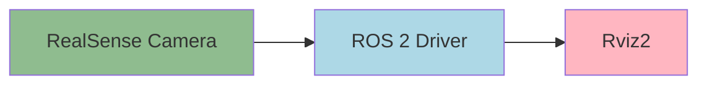

# Chapter 4: Computer Vision with RealSense

## Core Concepts

Computer vision is the foundation of robotic perception, enabling robots to interpret and understand their environment. Understanding the difference between 2D and 3D vision is crucial for working with RGB-D cameras like the Intel RealSense.

### **2D vs 3D Vision**

**2D images** consist of individual pixels arranged in a grid, each containing intensity or color values. They represent what a camera sees from a single viewpoint. These images capture appearance and texture but lack depth information.

**3D vision**, on the other hand, uses **RGB-D cameras** to capture both color (RGB) and depth (D) information. The depth data allows the robot to understand spatial relationships, distances, and object volumes. Instead of a 2D grid of pixels, the camera generates a **point cloud** – a set of data points in 3D space representing the coordinates (x, y, z) of object surfaces.

This **depth information** is critical for robotic perception as it enables:
- Obstacle detection and avoidance
- Distance measurements
- Spatial mapping
- Object recognition and manipulation

## Data Pipeline

RealSense cameras connect to your robot and publish data to ROS 2 topics, which can then be visualized in Rviz. Here's the flow:



## Installation Guide

To get started with the RealSense camera in ROS 2, you'll need to install the required packages.

### Installing RealSense Packages

First, update your package index to ensure you have access to the latest packages:

```bash
sudo apt update
```

Then install the RealSense2 camera package:

```bash
sudo apt install ros-humble-realsense2-camera
```

Optionally, install the development packages for advanced features:

```bash
sudo apt install ros-humble-librealsense2-dev
```

Before launching the camera, check that your RealSense device is properly detected:

```bash
rs-enumerate-devices
```

This command should list your connected RealSense device. If the device isn't detected, verify the USB connection and check that you have proper permissions to access the device.

## Launching the Camera

Once the packages are installed, you can launch the RealSense camera driver to begin streaming data:

```bash
ros2 launch realsense2_camera rs_launch.py
```

To enable depth stream specifically (if not enabled by default):

```bash
ros2 launch realsense2_camera rs_launch.py enable_depth:=true
```

For custom configurations, you can specify parameters like resolution:

```bash
ros2 launch realsense2_camera rs_launch.py camera_name:=mycam width:=640 height:=480
```

## Configuring Rviz for Visualization

Now that the camera is streaming data, let's visualize it in Rviz. Follow these steps:

1. Launch Rviz2 in a new terminal:
   ```bash
   ros2 run rviz2 rviz2
   ```

2. In the Displays panel, click the "Add" button at the bottom.

3. In the "Add Display" dialog, select "By topic".

4. Find and add `/camera/color/image_raw` as an Image display.

5. Again click "Add" and select "By topic".

6. Find and add `/camera/depth/color/points` as a PointCloud2 display.

7. To improve the visualization of the point cloud:
   - Expand the PointCloud2 display in the left panel
   - Change the "Color Transformer" to "RGB8" to visualize colors from the RGB camera
   - Adjust the "Size (m)" value to change the size of the point cloud visualization
   - Modify the "Style" to "Points" or "Flat Squares" based on your preference

With these configurations, you'll be able to see both the raw color image from the camera and the 3D point cloud data in Rviz.

## Validation

To verify that your RealSense camera is properly publishing data, use these commands:

Check that the camera topics are being published:
```bash
ros2 topic list | grep camera
```

Specifically verify the presence of these key topics:
- `/camera/color/image_raw` - The raw color image stream
- `/camera/depth/color/points` - The 3D point cloud data

You can also echo one of the topics to verify data flow:
```bash
ros2 topic echo /camera/color/image_raw --field data | head -n 5
```

For direct visualization of the image stream, you can use:
```bash
ros2 run image_view image_view --ros-args -p image:=/camera/color/image_raw
```

Confirm that Rviz is properly displaying both the image and the point cloud data. You should see real-time updates of your environment in both displays.

## Troubleshooting

If you're having issues with the camera:

- Ensure the RealSense device is properly connected via USB
- Run `rs-enumerate-devices` to verify the device is detected
- Make sure you've sourced your ROS 2 environment: `source /opt/ros/humble/setup.bash`
- Check that you have proper permissions to access the device
- Try unplugging and reconnecting the camera