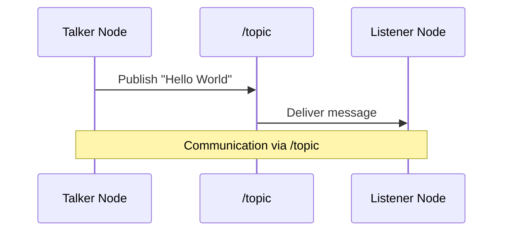

# Chapter 3: ROS 2 Basics

## Core Concepts

ROS 2 (Robot Operating System 2) is a flexible framework for writing robot software. At its heart lies a distributed computing architecture that enables different processes to communicate seamlessly.

### **Nodes**
**Nodes** are the fundamental building blocks of a ROS 2 system. Think of them as individual brain cells or organs in a living organism - each performing a specific function:

- A camera driver node captures images
- A motion planner node computes navigation paths
- A sensor fusion node combines data from various sensors

Nodes are individual executables that perform specific functions and communicate with other nodes in the network.

### **Topics**
**Topics** serve as the communication channels between nodes. They're like the neural pathways in a nervous system that carry signals between different parts of the body:

- Publishers send data to topics
- Subscribers receive data from topics
- Multiple nodes can publish to or subscribe from the same topic

### **Messages**
**Messages** are the actual data structures that travel between nodes via topics. These are standardized data formats that ensure all nodes understand the information being shared.

## Publisher/Subscriber Communication Model

The most common communication pattern in ROS 2 is the publisher/subscriber model. One node publishes data to a topic, and other nodes can subscribe to that topic to receive the data.



## Setting Up Your ROS 2 Workspace

A workspace is a directory where you will develop ROS 2 packages. Let's create and set up your first workspace:

### Creating the Workspace

1. Create the workspace directory structure:
   ```bash
   mkdir -p ~/ros2_ws/src
   ```

2. Navigate to your workspace:
   ```bash
   cd ~/ros2_ws
   ```

3. Build the workspace:
   ```bash
   colcon build
   ```

4. Source the setup file:
   ```bash
   source install/setup.bash
   ```

The `colcon build` command compiles all the packages in your workspace. The `source install/setup.bash` command sets up your environment so ROS 2 can find your packages.

## Creating the Publisher and Subscriber

Now let's create a simple publisher and subscriber to demonstrate ROS 2 communication.

### Publisher Node (Talker)

First, let's create a publisher node that sends "Hello World" messages:

```python
import rclpy
from rclpy.node import Node
from std_msgs.msg import String


class MinimalPublisher(Node):

    def __init__(self):
        super().__init__('minimal_publisher')
        self.publisher_ = self.create_publisher(String, 'topic', 10)
        timer_period = 0.5  # seconds
        self.timer = self.create_timer(timer_period, self.timer_callback)
        self.i = 0

    def timer_callback(self):
        msg = String()
        msg.data = 'Hello World: %d' % self.i
        self.publisher_.publish(msg)
        self.get_logger().info('Publishing: "%s"' % msg.data)
        self.i += 1


def main(args=None):
    rclpy.init(args=args)

    minimal_publisher = MinimalPublisher()

    rclpy.spin(minimal_publisher)

    # Destroy the node explicitly
    minimal_publisher.destroy_node()
    rclpy.shutdown()


if __name__ == '__main__':
    main()
```

Save this as `publisher_member_function.py` in the `~/ros2_ws/src/py_pubsub/py_pubsub` directory.

### Subscriber Node (Listener)

Next, let's create a subscriber node that listens to the messages:

```python
import rclpy
from rclpy.node import Node
from std_msgs.msg import String


class MinimalSubscriber(Node):

    def __init__(self):
        super().__init__('minimal_subscriber')
        self.subscription = self.create_subscription(
            String,
            'topic',
            self.listener_callback,
            10)
        self.subscription  # prevent unused variable warning

    def listener_callback(self, msg):
        self.get_logger().info('I heard: "%s"' % msg.data)


def main(args=None):
    rclpy.init(args=args)

    minimal_subscriber = MinimalSubscriber()

    rclpy.spin(minimal_subscriber)

    # Destroy the node explicitly
    minimal_subscriber.destroy_node()
    rclpy.shutdown()


if __name__ == '__main__':
    main()
```

Save this as `subscriber_member_function.py` in the same directory.

### Package Configuration

To create a ROS 2 package, you'll need a `package.xml` file:

```xml
<?xml version="1.0"?>
<?xml-model href="http://download.ros.org/schema/package_format3.xsd" schematypens="http://www.w3.org/2001/XMLSchema"?>
<package format="3">
  <name>py_pubsub</name>
  <version>0.0.0</version>
  <description>Python pubsub example</description>
  <maintainer email="you@example.com">Your Name</maintainer>
  <license>Apache License 2.0</license>

  <depend>rclpy</depend>
  <depend>std_msgs</depend>

  <exec_depend>rosidl_default_runtime</exec_depend>

  <test_depend>ament_copyright</test_depend>
  <test_depend>ament_flake8</test_depend>
  <test_depend>ament_pep257</test_depend>
  <test_depend>python3-pytest</test_depend>

  <export>
    <build_type>ament_python</build_type>
  </export>
</package>
```

### Setup Configuration

You'll also need a setup.py file:

```python
from setuptools import setup
from glob import glob
import os

package_name = 'py_pubsub'

setup(
    name=package_name,
    version='0.0.0',
    packages=[],
    py_modules=[
        'py_pubsub.publisher_member_function',
        'py_pubsub.subscriber_member_function',
    ],
    data_files=[
        ('share/ament_index/resource_index/packages',
            ['resource/' + package_name]),
        ('share/' + package_name, ['package.xml']),
        (os.path.join('share', package_name, 'launch'), glob('launch/*launch.[pxy][yma]*')),
    ],
    install_requires=['setuptools'],
    zip_safe=True,
    maintainer='Your Name',
    maintainer_email='you@example.com',
    description='Python pubsub example',
    license='Apache License 2.0',
    tests_require=['pytest'],
    entry_points={
        'console_scripts': [
            'talker = py_pubsub.publisher_member_function:main',
            'listener = py_pubsub.subscriber_member_function:main',
        ],
    },
)
```

## Building and Running the Example

After creating the files, navigate to your workspace and rebuild:

```bash
cd ~/ros2_ws
colcon build
```

Source the setup file to reload your workspace:

```bash
source install/setup.bash
```

## Validating the Communication

To verify that everything is working properly, we can use several command-line tools:

### Checking Active Nodes

```bash
ros2 node list
```

This command will show all currently active nodes in the ROS 2 system.

### Viewing Available Topics

```bash
ros2 topic list
```

This command will show all currently available topics in the ROS 2 system.

### Monitoring Messages on a Topic

```bash
ros2 topic echo /topic
```

This command listens to the messages being published on the `/topic` topic.

### Running Both Nodes Simultaneously

To run the publisher and subscriber simultaneously:

Terminal 1:
```bash
ros2 run py_pubsub talker
```

Terminal 2:
```bash
ros2 run py_pubsub listener
```

If everything is configured correctly, you should see the publisher sending "Hello World" messages and the subscriber receiving them.

## Troubleshooting Tips

- Make sure the workspace is sourced in each terminal: `source ~/ros2_ws/install/setup.bash`
- Check that package names and file paths are correct
- Verify that you've built your workspace after making changes: `colcon build`
- Ensure the talker and listener are publishing to and subscribing from the same topic name