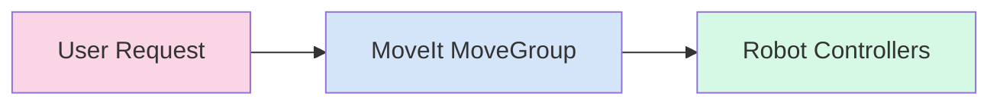

# Chapter 5: Arm Control & Motion Planning

## Core Concepts

**Motion Planning** is a fundamental aspect of robotics that involves finding a valid path or **trajectory** for a robot to move from an initial configuration to a goal configuration while avoiding obstacles. This computational problem requires considering robot kinematics, dynamics, and environmental constraints.

The process of **Planning** involves determining a sequence of valid configurations that connect the start and goal states, accounting for obstacles and other environmental factors. Motion planning algorithms must handle high-dimensional configuration spaces and potentially replan in real-time as conditions change.

### URDF and SRDF

**URDF** (Unified Robot Description Format) is an XML-based format used in ROS to describe the physical properties of a robot. It serves as the digital twin of the robot structure, defining links, joints, inertial properties, visual elements, and collision properties.

URDF describes the robot structure in terms of:
- Links: Rigid bodies of the robot
- Joints: Connections between links
- Kinematic chains: How parts of the robot connect

**SRDF** (Semantic Robot Description Format) is an extension to URDF that adds semantic information like groups of joints (e.g., "arm", "gripper"), default poses, and collision exceptions. SRDF provides higher-level concepts like planning groups (sets of joints to move together) and end effectors, making it easier to command complex robot movements.

## Architecture

MoveIt operates through a structured pipeline that connects user requests to robot execution:



## Installation Guide

To set up MoveIt for motion planning, install the necessary packages:

```bash
sudo apt update
```

Then install MoveIt:

```bash
sudo apt install ros-humble-moveit
```

Install additional resources and dependencies:

```bash
sudo apt install ros-humble-moveit-resources
sudo apt install ros-humble-libmoveit
```

Verify that the packages installed correctly:

```bash
apt list --installed | grep moveit
```

## Launching MoveIt

To launch the MoveIt demo with a preconfigured robot model:

```bash
ros2 launch moveit_resources demo.launch.py
```

This command will:
- Start the MoveIt MoveGroup node
- Load the robot model
- Launch Rviz with the MotionPlanning plugin already loaded

Wait for all nodes to initialize before proceeding to visualization and planning.

## Using the MotionPlanning Plugin in Rviz

Once MoveIt is running and Rviz has loaded:

1. Make sure the MotionPlanning plugin is visible in the Panels menu. If not, go to Panels → MotionPlanning to enable it.

2. In the "Context" tab of the MotionPlanning panel, set the Fixed Frame to the appropriate robot base frame (e.g., `panda_link0`).

3. In the MotionPlanning panel, go to the "Planning" tab.

4. Select your desired planning group from the dropdown (e.g., "panda_arm").

5. To plan a motion:
   - Select the "Interact" tool from the Rviz toolbar (it looks like a crosshair)
   - Click on the **Interaction Marker** - this is the colored ball at the end of the robotic arm (the end effector)
   - Drag the marker to your desired goal pose in 3D space

6. After positioning the marker, click the "Plan" button to generate a **trajectory**.

7. If the **Planning** is successful, click the "Execute" button to send the trajectory to the robot.

## Validation

To verify that the motion planning is working correctly:

1. Check that the **Interaction Marker** (the ball at the end of the arm) appears and can be selected with the Interact tool.

2. Confirm that the robot arm moves smoothly when a trajectory is successfully executed.

3. Verify that the MotionPlanning panel displays the robot model and planning interface correctly.

4. Ensure that the planning process completes without errors in the terminal where MoveIt is running.

5. Test collision avoidance by adding virtual obstacles in the environment and verifying that the **Planning** algorithm generates paths around them.

## Troubleshooting Tips

- If the **Interaction Marker** doesn't appear in Rviz, ensure the MotionPlanning plugin is loaded and the robot model is properly visualized.
- If planning fails frequently, check that your goal poses are within the robot's reachable workspace.
- If the arm doesn't execute planned trajectories, verify that controllers are properly configured and running.