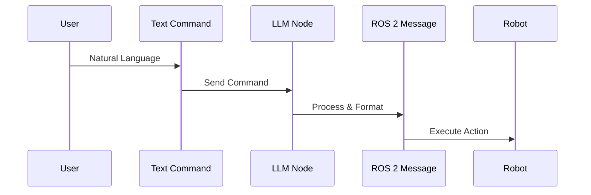

# Chapter 6: The AI Brain (LLMs & VLA Integration)

## Core Concepts

**VLA** (Vision-Language-Action) models represent a breakthrough in robotics by combining three essential modalities in a single AI system. These advanced systems process visual information from cameras and sensors, understand natural language commands and queries, and generate appropriate physical responses in the robot.

**VLA** models enable robots to understand complex tasks described in natural language and execute them in real-world environments. They learn complex relationships between visual input, language instructions, and appropriate robotic actions, creating a unified approach to robot intelligence.

The **Inference** process in these models involves taking visual data and language commands as input, processing them through the neural network, and generating appropriate action commands for the robot. This represents a significant departure from traditional robotics where perception, planning, and action were handled by separate, specialized modules.

**Zero-Shot** learning is another critical capability, allowing AI models to perform tasks they haven't been specifically trained on. This enables robots to handle novel situations and commands without requiring retraining, which is crucial for flexible human-robot interaction.

## Architecture

The AI brain operates through a structured pipeline connecting user commands to robot execution:



## Installation

To set up the AI brain, install the necessary Python libraries:

```bash
pip install openai langchain
```

Additionally, you may need to install ROS 2 Python packages:

```bash
sudo apt install ros-humble-geometry-msgs ros-humble-std-msgs
```

## The Brain Node

Here's the complete Python code for the **Brain Node** that integrates the LLM with ROS 2:

```python
#!/usr/bin/env python3

import rclpy
from rclpy.node import Node
from std_msgs.msg import String
from geometry_msgs.msg import Twist
from openai import OpenAI  # This would be your actual LLM library

class BrainNode(Node):
    def __init__(self):
        super().__init__('brain_node')
        
        # Publisher for robot commands
        self.cmd_vel_publisher = self.create_publisher(Twist, '/cmd_vel', 10)
        
        # Subscriber for user commands
        self.command_subscriber = self.create_subscription(
            String,
            'user_commands',
            self.command_callback,
            10
        )
        
        # Initialize the LLM client (mock implementation)
        # In practice, you would use your actual API key
        # self.llm_client = OpenAI(api_key='your-api-key')
        
        self.get_logger().info("AI Brain Node has started")

    def command_callback(self, msg):
        """Callback function when a user command is received"""
        user_command = msg.data
        self.get_logger().info(f"Received command: {user_command}")
        
        # Send the command to the LLM
        llm_response = self.send_to_llm(user_command)
        
        # Parse the LLM response
        parsed_command = self.parse_llm_response(llm_response)
        
        # Execute the parsed command
        self.execute_command(parsed_command)

    def send_to_llm(self, user_command):
        """Send the user command to the LLM and get a response"""
        # In a real implementation, this would call your LLM API
        # For this example, we'll simulate the response
        
        # Mock response instead of real API call
        mock_responses = {
            "move forward": "MOVE_FORWARD",
            "go forward": "MOVE_FORWARD",
            "move backward": "MOVE_BACKWARD",
            "go backward": "MOVE_BACKWARD",
            "turn left": "TURN_LEFT",
            "move left": "MOVE_LEFT",
            "turn right": "TURN_RIGHT",
            "move right": "MOVE_RIGHT",
            "stop": "STOP",
            "halt": "STOP"
        }
        
        return mock_responses.get(user_command.lower(), "UNKNOWN_COMMAND")

    def parse_llm_response(self, llm_response):
        """Parse the LLM response and convert to structured command"""
        # Convert the response to uppercase for consistency
        command = llm_response.upper()
        
        # Additional parsing could happen here
        # For now, we'll return the command as-is
        return command

    def execute_command(self, command):
        """Execute the parsed command by publishing the appropriate Twist message"""
        twist_msg = Twist()
        
        # Map string commands to Twist message values
        if command == "MOVE_FORWARD":
            twist_msg.linear.x = 0.5  # Move forward at 0.5 m/s
        elif command == "MOVE_BACKWARD":
            twist_msg.linear.x = -0.5  # Move backward at 0.5 m/s
        elif command == "TURN_LEFT" or command == "MOVE_LEFT":
            twist_msg.angular.z = 0.5  # Turn left at 0.5 rad/s
        elif command == "TURN_RIGHT" or command == "MOVE_RIGHT":
            twist_msg.angular.z = -0.5  # Turn right at 0.5 rad/s
        elif command == "STOP" or command == "HALT":
            # All velocities remain 0 (already initialized)
            pass
        else:
            self.get_logger().warn(f"Unknown command: {command}")
            return  # Don't publish anything for unknown commands
        
        # Publish the Twist message to control the robot
        self.cmd_vel_publisher.publish(twist_msg)
        self.get_logger().info(f"Published command: {command}")

def main(args=None):
    rclpy.init(args=args)
    
    brain_node = BrainNode()
    
    try:
        rclpy.spin(brain_node)
    except KeyboardInterrupt:
        pass
    finally:
        brain_node.destroy_node()
        rclpy.shutdown()

if __name__ == '__main__':
    main()
```

## Command Processing

The **Brain Node** processes natural language commands through several key steps:

1. A user sends a text command (e.g., "Move Forward")
2. The command is sent to the LLM for processing
3. The LLM response is parsed to extract a structured command
4. The structured command is converted into a `geometry_msgs/msg/Twist` message
5. The Twist message is published to the `/cmd_vel` topic to control the robot

The mapping between natural language and robot commands follows this pattern:
- "Move Forward" → `linear.x = 0.5` (forward movement)
- "Move Left" → `angular.z = 0.5` (left turn)
- "Turn Right" → `angular.z = -0.5` (right turn)
- "Stop" → All velocities = 0 (halt)

## Validation

To run the AI brain node:

```bash
ros2 run physical_ai_brain brain_node
```

In another terminal, send a command:

```bash
ros2 topic pub /user_commands std_msgs/String "data: 'move forward'"
```

Monitor the robot's movement by checking the `/cmd_vel` topic:

```bash
ros2 topic echo /cmd_vel
```

The expected output should show a Twist message with `linear.x` set to 0.5, indicating the robot is moving forward as requested.

## Troubleshooting

- If the node doesn't respond to commands, ensure the LLM API is properly configured
- Verify that the `/cmd_vel` topic is being published to by monitoring it with `ros2 topic echo /cmd_vel`
- Check that your robot's controller is subscribed to the `/cmd_vel` topic
- If using a real LLM API, ensure your API keys are correctly set up and you have sufficient credits
- For safety, implement a timeout mechanism to prevent the robot from executing indefinite motion commands