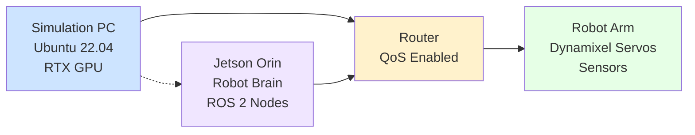

# Chapter 2 Implementation Plan: Hardware Lab Setup

## Overview
This plan details how to implement Chapter 2: Hardware Lab Setup based on the specification. It outlines user stories, asset requirements, technical steps, and validation procedures to guide the actual writing of the chapter content.

## User Stories
- **Story 1**: "As a student, I need a clear shopping list so I buy the right parts."
  - Acceptance criteria: BOM table includes component names, models, approximate prices, and purchase links
  - Definition: Comprehensive list of hardware components with pricing information to enable students to budget and purchase required equipment

- **Story 2**: "As an engineer, I need wiring diagrams to correctly connect components."
  - Acceptance criteria: Detailed wiring guide with illustrations and connection protocols
  - Definition: Step-by-step instructions for connecting all hardware components with safety measures

- **Story 3**: "As a developer, I need a network setup guide to establish communication between devices."
  - Acceptance criteria: SSH and network configuration guide for Ubuntu 22.04
  - Definition: Instructions for configuring network communication between Simulation PC, Jetson Orin, and robotic components

## Asset Plan

### Markdown Table for Bill of Materials (BOM)
Create a table in the chapter with the following columns:

| Component | Model | Approx Price | Link | Notes |
|-----------|-------|--------------|------|-------|
| Edge Computer | NVIDIA Jetson Orin Nano | $300-$400 | [NVIDIA Store] | 128 CUDA cores, 4GB RAM |
| Alternative Edge Computer | NVIDIA Jetson AGX Orin | $750-$1000 | [NVIDIA Store] | 2048 CUDA cores, 32GB RAM |
| Vision System | Intel RealSense D435i | $179 | [Intel Store] | RGB + Depth camera |
| Robot Arm | WidowX 250 6-DOF | $1000-$1200 | [Trossen Robotics] | 6 degrees of freedom |
| Simulation PC GPU | NVIDIA RTX 3060 (12GB) | $300-$400 | [Retailer] | Minimum requirement |
| Alternative GPU | NVIDIA RTX 4070 | $600-$700 | [Retailer] | Recommended option |
| Router | Enterprise-grade router | $100-$200 | [Electronics store] | Support QoS features |

### Mermaid JS Diagram Code for Network Topology
Include the following code in the chapter to generate the network diagram:



## Technical Steps

### Step 1: Explain Hardware Specs
- Introduce the concept of hardware selection for robotics applications
- Detail each component from the BOM with technical specifications
- Explain the rationale behind each selection (performance, cost-effectiveness, community support)
- Discuss key concepts: ARM64 vs x86 architecture, CUDA cores, Tensor cores
- Compare the primary and alternative options for each component category
- Include diagrams showing the physical dimensions and connector types of each component

### Step 2: Write the Wiring Guide
- Provide safety guidelines before starting any electrical work
- Outline the physical setup of the workspace
- Describe cable management best practices
- Step-by-step connection procedures:
  - Connecting power supplies to each component
  - Connecting data cables (USB, Ethernet, etc.) between components
  - Grounding considerations
- Include troubleshooting tips for common wiring issues
- Add warnings and precautions for handling sensitive components

### Step 3: Write the SSH & Network Setup Guide (Ubuntu 22.04)
- Prerequisites: Ensure Ubuntu 22.04 is installed and updated
- Enable SSH server on Jetson Orin:
  ```bash
  sudo systemctl enable ssh
  sudo systemctl start ssh
  ```
- Generate SSH key pairs on the main development machine:
  ```bash
  ssh-keygen -t rsa -b 4096
  ssh-copy-id jetson_username@jetson_ip_address
  ```
- Configure static IP addresses for reliable connections
- Setup network bridge or direct connection between devices
- Test connectivity using ping and SSH commands
- Troubleshoot common network configuration issues
- Secure the connection with proper firewall settings

## Validation
### How to verify the reader has set up the hardware correctly:
1. **Basic Connectivity Test**:
   ```bash
   ping <jetson_orin_ip_address>
   ```
   Expected result: Successful packet transmission and reception

2. **SSH Connection Test**:
   ```bash
   ssh jetson_username@<jetson_orin_ip_address>
   ```
   Expected result: Successful login to Jetson Orin terminal

3. **Component Recognition Verification**:
   - Test camera recognition: `rs-enumerate-devices` for RealSense
   - Verify robot arm connection: Check for Dynamixel servo communication
   - Confirm GPU detection: `nvidia-smi` on Simulation PC

4. **ROS 2 Network Connectivity**:
   ```bash
   # From Jetson Orin
   export ROS_DOMAIN_ID=0
   export ROS_LOCALHOST_ONLY=0
   ros2 topic list
   ```
   ```bash
   # From Simulation PC
   export ROS_DOMAIN_ID=0
   export ROS_LOCALHOST_ONLY=0
   ros2 topic list
   ```
   Expected result: Both devices should see the same ROS topics when nodes are active

5. **Hardware Status Check Script**:
   Create a script that verifies all components are properly connected:
   ```bash
   #!/bin/bash
   echo "Checking hardware connections:"
   
   # Check if RealSense camera is detected
   lsusb | grep -i intel
   if [ $? -eq 0 ]; then
       echo "✓ RealSense camera detected"
   else
       echo "✗ RealSense camera not detected"
   fi
   
   # Check if Jetson is accessible
   ping -c 1 <jetson_ip> > /dev/null 2>&1
   if [ $? -eq 0 ]; then
       echo "✓ Jetson Orin accessible"
   else
       echo "✗ Jetson Orin not accessible"
   fi
   
   # Check GPU
   nvidia-smi > /dev/null 2>&1
   if [ $? -eq 0 ]; then
       echo "✓ NVIDIA GPU detected"
   else
       echo "✗ NVIDIA GPU not detected"
   fi
   ```

## Success Criteria
- Students can successfully purchase and assemble all required hardware components
- Network connection between all devices is established and functional
- All hardware components are recognized by their respective systems
- Basic communication between Simulation PC and Jetson Orin is confirmed
- Students understand the technical specifications and rationale for each component selection