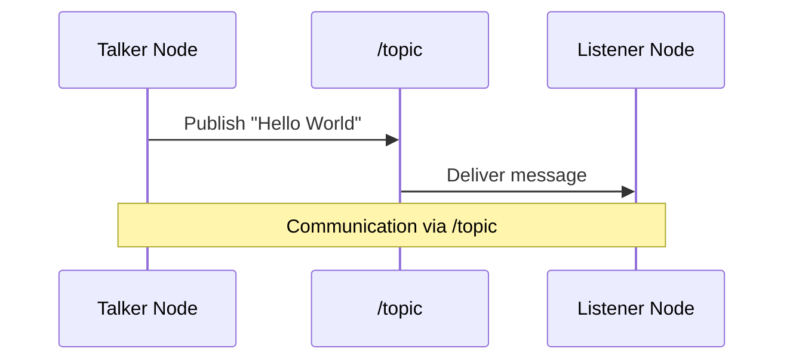

# Implementation Plan: Chapter 3 - ROS 2 Basics

## Overview
This plan details how to explain ROS 2 concepts with hands-on examples, focusing on the graph metaphor, publisher-subscriber model, and practical implementation.

## User Stories
- As a beginner, I want to see two nodes talk so I understand the concept.
- As a beginner, I want to understand the graph metaphor of ROS 2 (nodes and topics) before diving into code.
- As a learner, I want to set up my own ROS 2 workspace to practice the concepts.
- As a developer, I want to create a simple publisher and subscriber example to solidify my understanding.
- As a user, I want to validate that my nodes are communicating properly.

## Asset Plan
- **Mermaid JS Sequence Diagram**: Showing the flow from `talker` -> `/topic` -> `listener`


## Technical Steps

### Step 1: Explain the "Graph" Concept Simply
- Describe ROS 2 as a network of computers/software modules (nodes) that communicate with each other
- Analogize to a city with departments that need to share information
- Introduce the key concepts:
  - **Nodes**: Individual executables that perform specific functions
  - **Topics**: Communication channels through which nodes exchange messages
  - **Messages**: The data being passed between nodes

### Step 2: Guide User to Set Up `~/ros2_ws`
- Explain what a workspace is in ROS 2 context (a directory where you develop ROS packages)
- Provide the setup commands:
```
mkdir -p ~/ros2_ws/src
cd ~/ros2_ws
colcon build
source install/setup.bash
```
- Explain each command's purpose
- Show how to verify the workspace was created correctly

### Step 3: Provide the Python Code for Publisher & Subscriber
#### Publisher (Talker) - publisher_member_function.py:
```python
import rclpy
from rclpy.node import Node
from std_msgs.msg import String


class MinimalPublisher(Node):

    def __init__(self):
        super().__init__('minimal_publisher')
        self.publisher_ = self.create_publisher(String, 'topic', 10)
        timer_period = 0.5  # seconds
        self.timer = self.create_timer(timer_period, self.timer_callback)
        self.i = 0

    def timer_callback(self):
        msg = String()
        msg.data = 'Hello World: %d' % self.i
        self.publisher_.publish(msg)
        self.get_logger().info('Publishing: "%s"' % msg.data)
        self.i += 1


def main(args=None):
    rclpy.init(args=args)

    minimal_publisher = MinimalPublisher()

    rclpy.spin(minimal_publisher)

    # Destroy the node explicitly
    minimal_publisher.destroy_node()
    rclpy.shutdown()


if __name__ == '__main__':
    main()
```

#### Subscriber (Listener) - subscriber_member_function.py:
```python
import rclpy
from rclpy.node import Node
from std_msgs.msg import String


class MinimalSubscriber(Node):

    def __init__(self):
        super().__init__('minimal_subscriber')
        self.subscription = self.create_subscription(
            String,
            'topic',
            self.listener_callback,
            10)
        self.subscription  # prevent unused variable warning

    def listener_callback(self, msg):
        self.get_logger().info('I heard: "%s"' % msg.data)


def main(args=None):
    rclpy.init(args=args)

    minimal_subscriber = MinimalSubscriber()

    rclpy.spin(minimal_subscriber)

    # Destroy the node explicitly
    minimal_subscriber.destroy_node()
    rclpy.shutdown()


if __name__ == '__main__':
    main()
```

#### Package Configuration - package.xml:
```xml
<?xml version="1.0"?>
<?xml-model href="http://download.ros.org/schema/package_format3.xsd" schematypens="http://www.w3.org/2001/XMLSchema"?>
<package format="3">
  <name>py_pubsub</name>
  <version>0.0.0</version>
  <description>Python pubsub example</description>
  <maintainer email="you@example.com">Your Name</maintainer>
  <license>Apache License 2.0</license>

  <depend>rclpy</depend>
  <depend>std_msgs</depend>

  <exec_depend>rosidl_default_runtime</exec_depend>

  <test_depend>ament_copyright</test_depend>
  <test_depend>ament_flake8</test_depend>
  <test_depend>ament_pep257</test_depend>
  <test_depend>python3-pytest</test_depend>

  <export>
    <build_type>ament_python</build_type>
  </export>
</package>
```

#### Setup Configuration - setup.py:
```python
from setuptools import setup
from glob import glob
import os

package_name = 'py_pubsub'

setup(
    name=package_name,
    version='0.0.0',
    packages=[],
    py_modules=[
        'py_pubsub.publisher_member_function',
        'py_pubsub.subscriber_member_function',
    ],
    data_files=[
        ('share/ament_index/resource_index/packages',
            ['resource/' + package_name]),
        ('share/' + package_name, ['package.xml']),
        (os.path.join('share', package_name, 'launch'), glob('launch/*launch.[pxy][yma]*')),
    ],
    install_requires=['setuptools'],
    zip_safe=True,
    maintainer='Your Name',
    maintainer_email='you@example.com',
    description='Python pubsub example',
    license='Apache License 2.0',
    tests_require=['pytest'],
    entry_points={
        'console_scripts': [
            'talker = py_pubsub.publisher_member_function:main',
            'listener = py_pubsub.subscriber_member_function:main',
        ],
    },
)
```

## Validation
- Run `ros2 node list` to check if nodes are running
- Run `ros2 topic list` to verify the topic exists
- Run `ros2 topic echo /topic` to listen to the messages
- Execute the publisher and subscriber to verify communication:
  - Terminal 1: `ros2 run py_pubsub talker`
  - Terminal 2: `ros2 run py_pubsub listener`
- Verify that messages are flowing from the talker to the listener