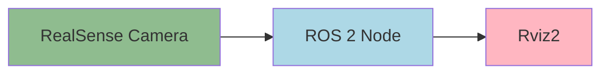

# Implementation Plan: Chapter 4 - Computer Vision with RealSense

## Overview
This plan details how to implement the vision system using Intel RealSense camera with ROS 2, focusing on setting up the hardware, launching drivers, and visualizing data in Rviz.

## User Stories
- As a student, I want to see the 3D point cloud so I know the camera works.
- As a beginner, I want to understand the difference between 2D images and 3D point clouds.
- As a developer, I want to install and configure the RealSense camera in ROS 2.
- As a user, I want to visualize both RGB and depth data in Rviz.
- As a learner, I want to verify that the camera topics are publishing data correctly.

## Asset Plan
- **Mermaid JS Flowchart**: Showing the data flow from `RealSense` -> `ROS 2 Node` -> `Rviz2`


## Technical Steps

### Step 1: Install ROS 2 packages for RealSense
- Update package index and install the RealSense2 camera package:
```bash
sudo apt update
sudo apt install ros-humble-realsense2-camera
```
- Optionally, install the development packages for advanced features:
```bash
sudo apt install ros-humble-librealsense2-dev
```
- Check that the RealSense device is detected:
```bash
rs-enumerate-devices
```

### Step 2: Command to launch the camera driver
- Launch the RealSense camera driver with default parameters:
```bash
ros2 launch realsense2_camera rs_launch.py
```
- To enable depth stream specifically (if not enabled by default):
```bash
ros2 launch realsense2_camera rs_launch.py enable_depth:=true
```
- To launch with specific settings (e.g., resolution):
```bash
ros2 launch realsense2_camera rs_launch.py camera_name:=mycam width:=640 height:=480
```

### Step 3: Instructions to configure Rviz (Add -> Image/PointCloud2)
- Open Rviz:
```bash
ros2 run rviz2 rviz2
```
- Once Rviz opens:
  - Click "Add" in the bottom left panel
  - Select "By topic"
  - Find and add `/camera/color/image_raw` as an Image display
  - Find and add `/camera/depth/color/points` as a PointCloud2 display
- Adjust the PointCloud2 display settings:
  - Change "Color Transformer" to "RGB8" to visualize colors from the RGB camera
  - Adjust "Size (m)" to change the size of the point cloud visualization
  - Modify "Style" to "Points" or "Flat Squares" based on preference

## Validation
- Check that the camera topics are being published:
```bash
ros2 topic list | grep camera
```
- Specifically verify the presence of these key topics:
  - `/camera/color/image_raw` - The raw color image stream
  - `/camera/depth/color/points` - The 3D point cloud data
- Echo one of the topics to verify data flow:
```bash
ros2 topic echo /camera/color/image_raw --field data | head -n 5
```
- Use image view to directly visualize the image stream:
```bash
ros2 run image_view image_view --ros-args -p image:=/camera/color/image_raw
```
- Confirm that Rviz is displaying both image and point cloud data properly