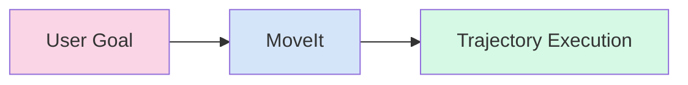

# Implementation Plan: Chapter 5 - Arm Control & Motion Planning

## Overview
This plan details how to set up MoveIt 2 for robotic arm control and motion planning, focusing on understanding URDF, installing MoveIt packages, and using the MotionPlanning plugin for interactive control.

## User Stories
- As a student, I want to move the robot arm virtually to understand motion planning.
- As a beginner, I want to understand the basics of URDF and SRDF before working with MoveIt.
- As a developer, I want to install MoveIt 2 packages and set up the environment.
- As a user, I want to launch the MoveIt demo to start experimenting.
- As a learner, I want to use the MotionPlanning plugin in Rviz to plan and execute arm movements.

## Asset Plan
- **Mermaid JS Flowchart**: Showing the data flow from `User Goal` -> `MoveIt` -> `Trajectory Execution`


## Technical Steps

### Step 1: Explain URDF and SRDF briefly
- URDF (Unified Robot Description Format) is an XML format that describes robot structure: links, joints, and their connections
- SRDF (Semantic Robot Description Format) is an extension to URDF that adds semantic information like groups of joints (e.g., "arm", "gripper"), default poses, and collision exceptions
- URDF defines the physical structure of the robot (kinematic chains, joint limits, visual/collision properties)
- SRDF provides higher-level concepts like planning groups (sets of joints to move together), end effectors, and default states

### Step 2: Install MoveIt packages
- Update package index and install MoveIt 2 packages:
```bash
sudo apt update
sudo apt install ros-humble-moveit
```
- Install additional dependencies if needed:
```bash
sudo apt install ros-humble-moveit-resources
sudo apt install ros-humble-libmoveit
```
- Verify installation by checking available MoveIt packages:
```bash
apt list --installed | grep moveit
```

### Step 3: Guide to launch the demo launch file
- Launch MoveIt with the default demo setup (this includes a preconfigured robot model):
```bash
ros2 launch moveit_resources demo.launch.py
```
- Alternatively, for a specific robot configuration:
```bash
ros2 launch <robot_name>_moveit_config demo.launch.py
```
- Wait for the launch to complete - this will start Rviz with the MotionPlanning plugin loaded

### Step 4: Instructions on using the "MotionPlanning" Rviz plugin
- In Rviz, confirm that the MotionPlanning plugin is loaded in the Panels menu
- Navigate to the "Context" tab and set the Fixed Frame to the appropriate robot base frame (e.g., `panda_link0`)
- In the "MotionPlanning" panel, go to the "Planning" tab
- Select the planning group (e.g., "panda_arm") from the dropdown
- Use the "Interact" tool in the toolbar to select the interactive marker for the end effector
- Drag the interactive marker to a desired goal pose
- Click the "Plan" button to generate a motion plan
- If the plan is successful, click "Execute" to send the trajectory to the robot

## Validation
- Verify that the interactive marker appears when using the "Interact" tool
- Confirm that the robot arm moves in Rviz when a trajectory is executed
- Check that the MotionPlanning panel shows the robot model and planning interface
- Ensure that the planning process completes successfully without errors
- Validate that collision avoidance is working by adding virtual obstacles and planning around them