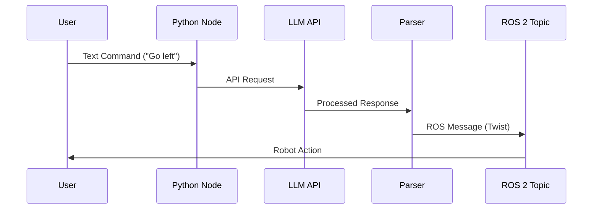

# Implementation Plan: Chapter 6 - The AI Brain (LLMs & VLA Integration)

## Overview
This plan details how to integrate an LLM with ROS 2 to control a robot using natural language commands, focusing on connecting the VLA models to ROS 2 nodes and translating text commands into robot actions.

## User Stories
- As a user, I want to type "Move forward" and have the robot actually move.
- As a developer, I want to connect an LLM API to process natural language commands.
- As a roboticist, I want to convert AI responses to ROS 2 messages like Twist.
- As a user, I want to see the robot respond to complex instructions like "Go to the kitchen and pick up the red cup."
- As a safety engineer, I want to ensure the system validates commands before execution.

## Asset Plan
- **Mermaid JS Sequence Diagram**: Showing the data flow `User` -> `Python Node` -> `LLM API` -> `Parser` -> `ROS 2 Topic`


## Technical Steps

### Step 1: Explain the concept of VLA (Vision-Language-Action)
- VLA models are advanced AI systems that combine three modalities:
  - **Vision**: Processing visual information from cameras and sensors
  - **Language**: Understanding natural language commands and queries
  - **Action**: Generating appropriate physical responses in the robot
- These models enable robots to understand complex tasks described in natural language and execute them in real-world environments
- VLA models learn complex relationships between visual input, language instructions, and appropriate robotic actions
- The integration in our system allows the robot to understand both what it sees and what it's being told to do

### Step 2: Create a Python script using `openai` or `langchain` library
- Install required dependencies:
```bash
pip install openai langchain
```
- Set up API keys for the LLM provider
- Create the main Python script that will handle communication with the LLM API
- Implement error handling for API communication
- Design a function that takes a text command and returns structured output that can be parsed into robot commands

### Step 3: Write logic to map text ("Go left") to Velocity Commands (`Twist`)
- Create a mapping function that parses the LLM response for movement commands
- Map natural language terms to ROS 2 Twist message components:
  - "Move forward" → linear.x = positive value
  - "Go left" → angular.z = positive value
  - "Turn right" → angular.z = negative value
  - "Stop" → all velocities = 0
- Implement validation logic to ensure safe commands
- Design a parser that can extract structured commands from the LLM's natural language response

### Step 4: Create a ROS 2 Publisher for `/cmd_vel` or `/move_group`
- Initialize a ROS 2 node for the AI brain
- Create a publisher for the `/cmd_vel` topic (for simple navigation)
- Optionally, create publishers for more complex action topics like `/move_group` (for arm control)
- Implement the logic to publish Twist messages based on parsed LLM responses
- Add safety checks to prevent dangerous commands from being executed

## Validation
- Test by sending a simple text command like "Move forward" and observing the robot/simulated output
- Verify that the `/cmd_vel` topic receives appropriate Twist messages
- Test with more complex commands and ensure they're properly parsed
- Confirm that safety validation prevents dangerous commands
- Check that the system handles ambiguous commands appropriately (e.g., with error messages or requests for clarification)
- Validate that the robot executes commands in the correct sequence when given multi-step instructions